## 功能介绍 

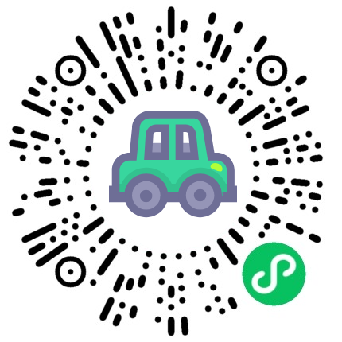

 4S店小程序：是为汽车 4S 店打造的轻量化服务平台，旨在提升客户到店体验、优化门店运营效率，实现线上线下服务闭环。它既为车主及潜在客户提供便捷的信息获取、服务预约、个人中心管理等功能，也为 4S 店管理员提供高效的内容维护、预约管理、用户管理及数据导出等后台能力。对客户：信息获取更及时，到店体验更流畅，个人服务管理更便捷。对 4S 店：运营管理更高效，数据统计更精准，服务质量可量化。

## 技术运用
- 前端基于微信小程序平台进行开发
- 后端基于Java Springboot架构开发
- 数据库： MySQL (8.0+) 

## 演示 
 

## 安装

- 安装手册见源码包里的word文档 

## 截图

 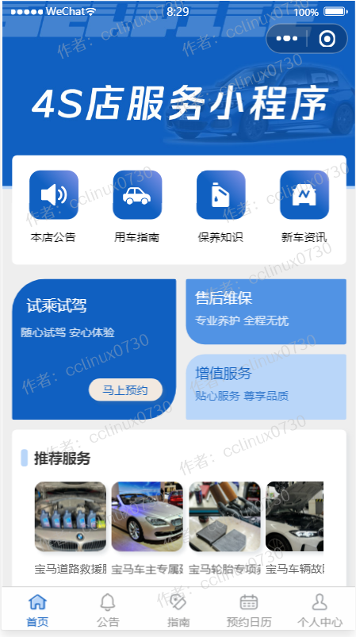

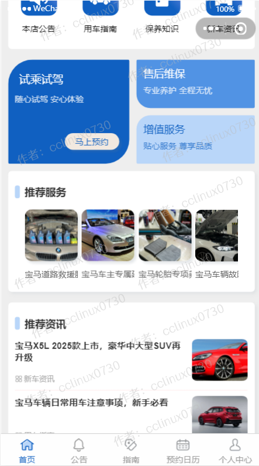
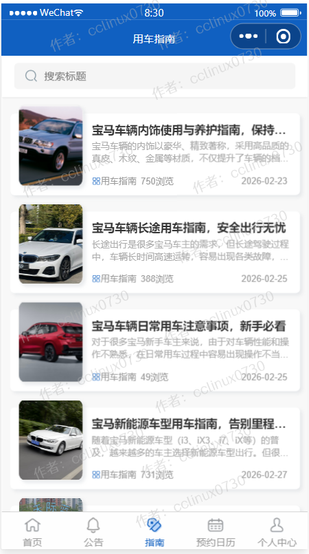
 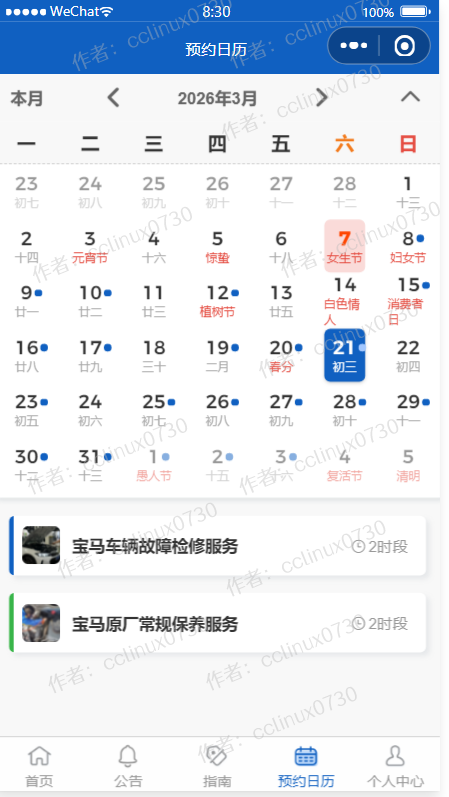

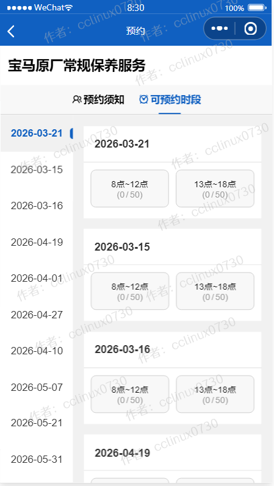
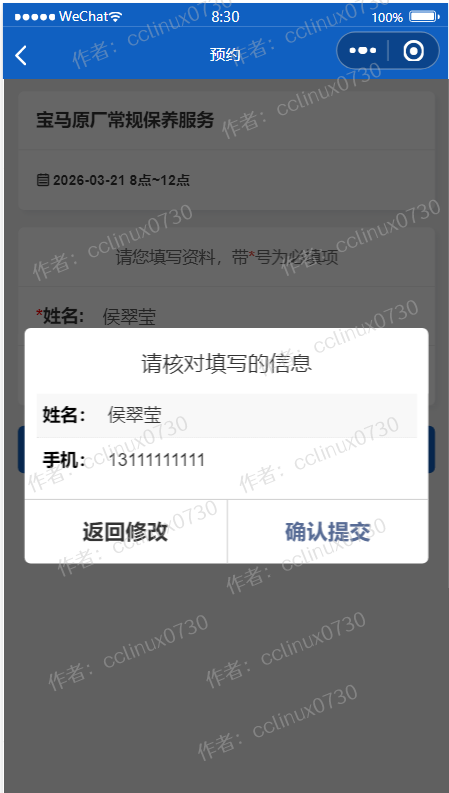

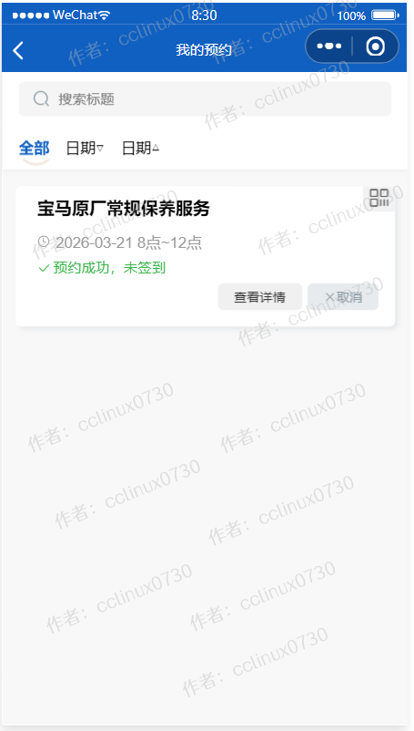

## 后台管理系统截图 
- 后台超级管理员默认账号:admin，密码123456，请登录后台后及时修改密码和创建普通管理员。

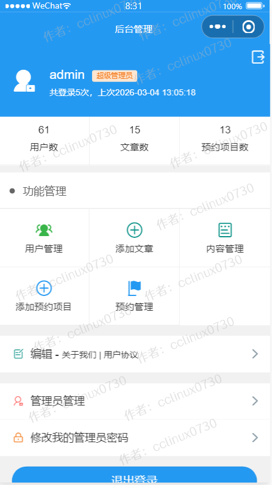
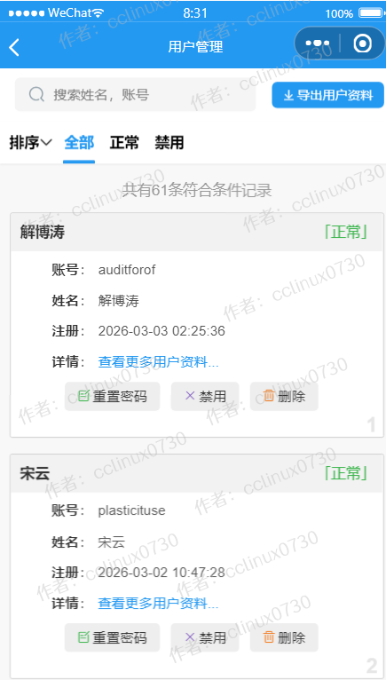
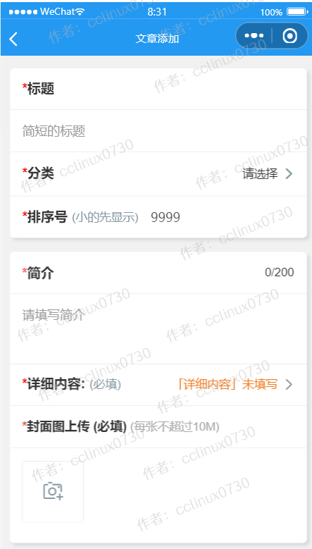

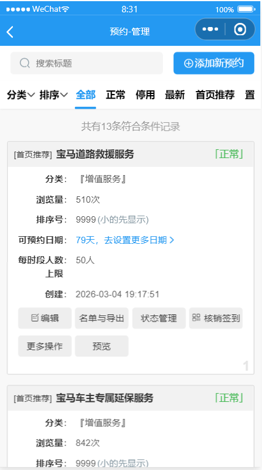

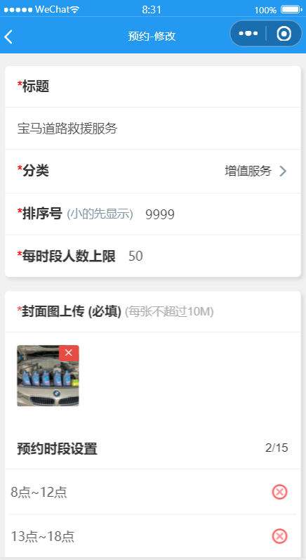

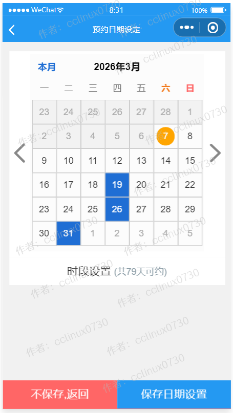
 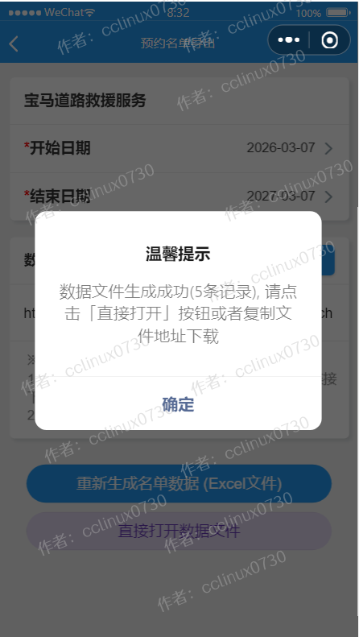
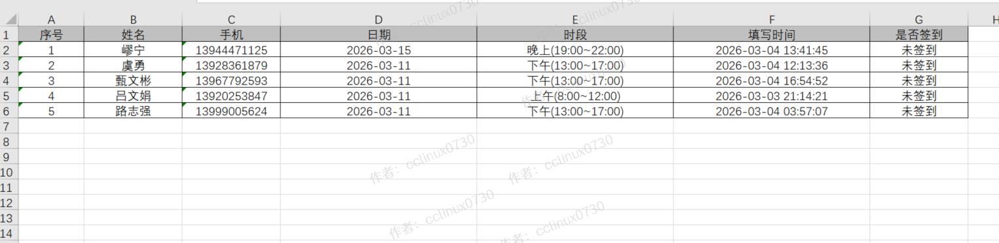
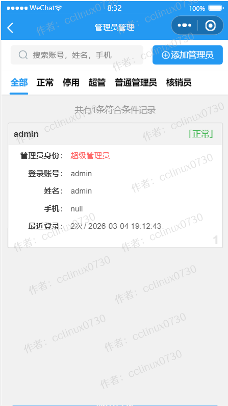